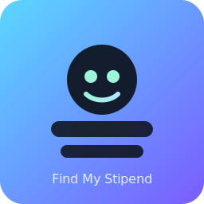

<div align="center">

<div align="center">

	

	<h1>Find My Stipend</h1>
	<p>Find internships faster. Build your portfolio. Connect with real recruiters.</p>

	<p>
		<a href="#features"></a>
		<a href="#quickstart"></a>
		<a href="#license"></a>
	</p>

	
</div>

---

Find My Stipend is a full-stack app that blends multiple job sources (Internshala, LinkedIn, company ATS careers) with resume-aware ranking, an AI-powered portfolio generator (Gemini), and HR tooling that surfaces real recruiter profiles to connect with—ready for Render + Vercel deployment.

## Table of Contents
- [Features](#features)
- [Demo Shots](#demo-shots)
- [Architecture](#architecture)
- [Quickstart](#quickstart)
- [Configuration](#configuration)
- [Usage](#usage)
- [Development](#development)
- [Deploy](#deploy)
- [Troubleshooting](#troubleshooting)
- [License](#license)

## Features
- Blended internship search
	- Internshala + LinkedIn + ATS company careers (Lever, Greenhouse, Workday, SmartRecruiters, generic pages)
	- Resume-aware queries and result scoring; “hot” tags; newness signal
	- Source filters and counts; direct company “Apply Now” links
- LinkedIn premium signals
	- Detects Easy Apply, promoted, actively hiring; optional Easy Apply variant
- HR tooling that actually helps
	- People-search links for LinkedIn (skills/roles/location)
	- Real recruiter profiles discovery via public web search for `/in/` profiles
	- Batch mode: grouped recruiter cards by company, with Connect buttons
- AI portfolio generator
	- Template + enrichment mode (fast, clean)
	- Full-site Gemini mode: returns a complete `index.html` + `styles.css` based on your resume
	- One-click ZIP download; Vercel/Pages friendly
- Resume analyzer
	- Missing keywords, AI-flagged weak points, grammar fixes
- Smooth UI
	- React + Vite + TypeScript + Tailwind/shadcn; animations via Framer Motion

## Demo Shots

<details>
<summary>Dashboard — Search & Filters</summary>


</details>

<details>
<summary>Recruiter Profiles — Grouped by Company</summary>


</details>

<details>
<summary>Instant Portfolio — AI ZIP Download</summary>


</details>

## Architecture
- Frontend: React (Vite) + TypeScript + Tailwind/shadcn
	- `src/services/*` for API calls, `src/components/*` for UI (Dashboard, JobCard, HR panels)
- Backend: FastAPI
	- Scrapers: Internshala, LinkedIn (HTTP-first with fallback), ATS (Lever/Greenhouse/SmartRecruiters/Workday), Generic
	- Routes: `/api/search`, `/api/upload-resume`, `/api/portfolio/generate`, `/api/linkedin/hr-links`, `/api/linkedin/hr-profiles`, `/api/linkedin/hr-profiles/batch`
	- AI: OpenRouter (chat/analyzer) and Gemini proxy (portfolio)
	- Render-friendly; CORS and health endpoints

## Quickstart

Prereqs: Node 18+, Python 3.11+, Git

```powershell

<br/>


</div>

## ✨ What it does
- Finds real internships from multiple sources (Internshala, LinkedIn, company careers like Lever/Greenhouse/SmartRecruiters/Workday) and ranks them to your resume.
- Improves your resume with AI: keyword coverage, missing terms, weak points, grammar fixes.
- Conducts smart mock interviews (5–6 questions) that adapt to your answers and resume.
- Helps you connect with HRs/recruiters via relevant LinkedIn search links.
- Generates tailored cover letters/connection notes.
- One‑click “Instant Portfolio” ZIP for Vercel/GitHub Pages.
- Real student hiring stories — share your blurred offer letter testimonial from the homepage.

## 🧠 Feature highlights
- Internship Search
	- LinkedIn optional path; ATS company careers coverage (Lever/Greenhouse/SmartRecruiters/Workday) with generic fallback
- Resume Genius
	- Rule‑based scoring (0–100) + missing keywords list
	- AI enrichment (suggestions, weak points, grammar) via OpenRouter/Gemini
- Mock Interview
	- Session‑aware: reads your uploaded resume
	- Generates 5–6 simple, practical questions (2 behavioral + technical aligned to skills)
- Messages
	- Short cover letters/LinkedIn notes (LLM fallback to template)
- Instant Portfolio
- Testimonials
	- “Got Hired via FindMyStipend?” submission (image + note); grid showcased on homepage

## 🏗️ Tech
- Backend: FastAPI (Python), Requests+BS4, PyMuPDF/python‑docx, optional Playwright/Selenium
- Deploy: Vercel (FE), Render/EB (BE)

## 🖼️ Screens (add your screenshots)
- Dashboard: analyzer, HR links, ranked jobs
- Testimonials: success stories grid

## ⚙️ Quickstart (Windows)
```powershell
./dev.ps1 -BackendPort 8000 -FrontendPort 5173 -KillRange
```

Manual setup
```powershell
# Backend
cd backend
pip install -r requirements.txt
python -m uvicorn main:app --host 127.0.0.1 --port 8000 --reload

# Frontend (new terminal at repo root)
npm install
$env:VITE_API_BASE = 'http://127.0.0.1:8000'
npm run dev
```

macOS/Linux
```bash
cd backend && pip install -r requirements.txt
python3 -m uvicorn main:app --host 127.0.0.1 --port 8000 --reload
cd .. && npm install
export VITE_API_BASE=http://127.0.0.1:8000
npm run dev
```

Open http://127.0.0.1:5173.

## 🔐 Environment
Backend (`backend/.env`)
```
PORT=8000
OPENROUTER_API_KEY=sk-or-...
OPENROUTER_MODELS=deepseek/deepseek-chat-v3-0324:free,meta-llama/llama-3.1-8b-instruct:free
OPENROUTER_BASE=https://openrouter.ai/api/v1/chat/completions
FRONTEND_ORIGIN=http://127.0.0.1:5173
CORS_ORIGINS=http://localhost:5173,http://127.0.0.1:5173
# Options
DISABLE_LINKEDIN=1
SEARCH_TIME_BUDGET=14.0
SEARCH_MAX_QUERIES=10
SEARCH_PER_QUERY_LIMIT=20
```
Frontend (optional)
```
VITE_API_BASE=http://127.0.0.1:8000
```

## 🔌 REST cheatsheet
- GET `/health`, `/version`
- POST `/api/upload-resume` (multipart)
- POST `/api/search` → internship list with `score` and `is_new`
- Company careers
	- POST `/api/internships/scrape`
	- POST `/api/internships/scrape-batch`
- LinkedIn tools
	- POST `/api/linkedin/hr-links`
- Resume Analyzer
	- POST `/api/analyze/resume-vs-jobs`
- Messages
	- POST `/api/messages/cover-letter`
- Portfolio
	- POST `/api/portfolio/generate`
- Mock Interview
	- POST `/api/mock-interview/start`
	- POST `/api/mock-interview/followup`
- Testimonials
	- GET/POST `/api/testimonials`
	- GET `/api/testimonials/image/{filename}`

## 🧪 Smoke tests
```powershell
python backend/smoke_test.py
```
Optional:
```powershell
pytest -q -k "analyzer or messages or portfolio"
```

## 🗺️ 3‑min pitch
- Pain → Vision → Demo: upload resume → analyzer → HR links → search results (Apply Now) → mock interview (speak, barge‑in, feedback) → one‑click portfolio → real testimonials.
- Impact: saves time, increases call‑backs, boosts confidence.

## 🛠️ Troubleshooting
- CORS: include your FE origin in `CORS_ORIGINS`.
- PDF parsing: install PyMuPDF; DOCX/TXT are supported.
- LinkedIn blocked? Set `DISABLE_LINKEDIN=1`.
- Slow search? Tune `SEARCH_TIME_BUDGET`, reduce `SEARCH_MAX_QUERIES`.

## 🏁 License & Credits
MIT — Made by Shriya Gakkhar and Ruchin Audichya.
